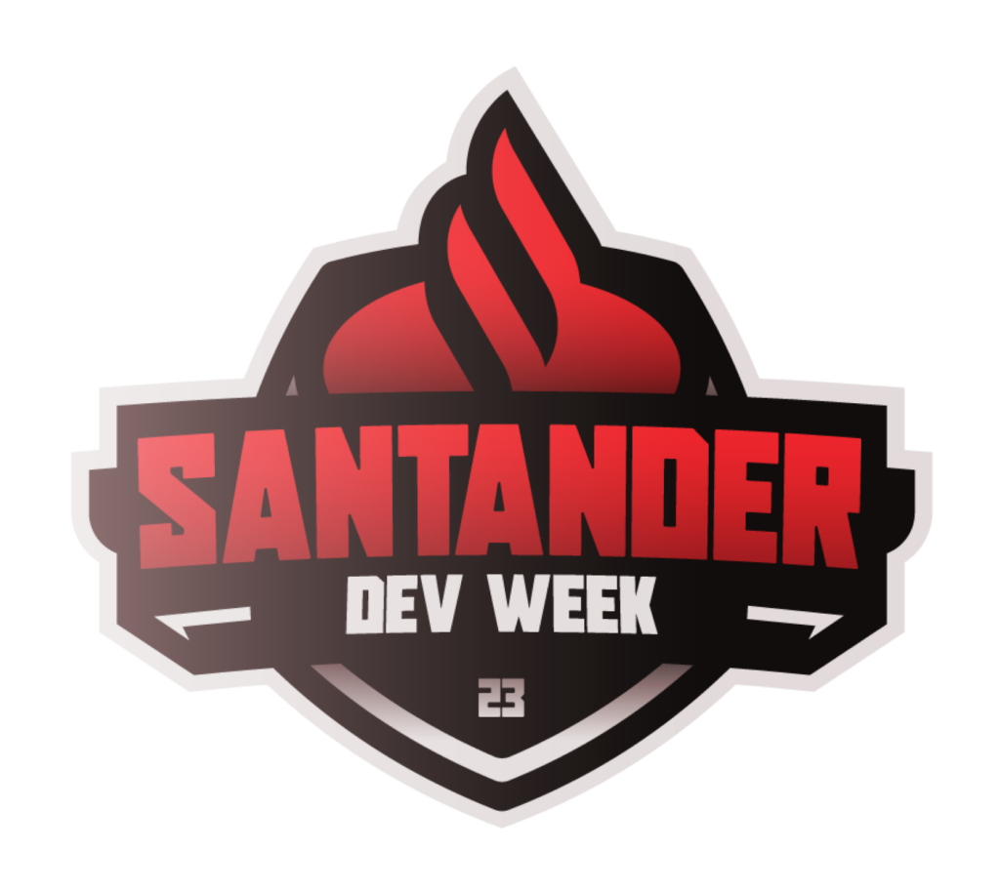

# Projeto de Pipeline de ETL para Acompanhamento de Gastos Pessoais
<div align="center">
  <a href="https://github.com/BVictorsk/SDW23_ETL">
    
  </a>
  <h3 align="center">Santander Bootcamp 2023 - Ciência de Dados com Python</h3>
  <p align="center">
    An ETL pipeline for the Santander Bootcamp 2023 - Daata science with Python.
</div>

<br>

<div align="center">
      
      
</div>

## Visão Geral
Este projeto tem como objetivo criar um Pipeline de ETL (Extração, Transformação e Carregamento) utilizando o ambiente do Google Colab. O objetivo principal é extrair dados de um arquivo CSV relacionado ao Acompanhamento de Gastos Pessoais e prepará-los para análises posteriores. O projeto foi desenvolvido como parte do desafio do bootcamp de análise de dados do Santander.

## Estrutura do Projeto
O projeto está organizado da seguinte forma:

Notebooks: Esta pasta contém o Jupyter Notebook principal que descreve o processo de ETL passo a passo.
data: Este diretório é onde você deve colocar o arquivo CSV com os dados de Acompanhamento de Gastos Pessoais.
output: Esta pasta conterá os resultados do processo ETL, como os dados transformados ou um novo arquivo CSV.

## Executando o Pipeline de ETL
Siga os passos abaixo para executar o Pipeline de ETL:

Faça o upload do arquivo CSV com os dados de Acompanhamento de Gastos Pessoais para a pasta data deste projeto.
Abra o Jupyter Notebook principal localizado na pasta Notebooks usando o Google Colab.
Siga as instruções no notebook para executar cada etapa do processo de ETL. Isso incluirá a extração, transformação e carregamento dos dados.
Os resultados do processo serão armazenados na pasta output.

### Dependências
> Pandas: Para manipulação e transformação dos dados.


# Autor
Brian Victor Saka

## Clone

### Starting

```
git clone https://github.com/BVictorsk/SDW23_ETL.git
npm install
```


### Contribute 🚀

If you want to contribute, clone this repo, create your work branch and get your hands dirty!

```bash
git clone https://github.com/BVictorsk/SDW23_ETL.git
git checkout -b feature/NAME
```

 At the end, open a Pull Request explaining the problem solved or feature made, if exists, append screenshot of visual modifications and wait for the review!

[How to create a Pull Request](https://www.atlassian.com/br/git/tutorials/making-a-pull-request)

[Commit pattern](https://gist.github.com/joshbuchea/6f47e86d2510bce28f8e7f42ae84c716)

<h2 id="license">License 📃 </h2>

This project is under MIT license
